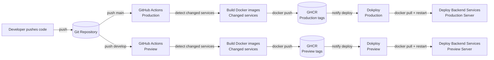

# Backend Deployment

The backend of the project is automatically deployed using Github Actions and Dokploy.

When a change is pushed to the `main` branch (for production environment) and the `develop` branch (for preview environment), a GitHub Action is triggered to build the specific changed services and create a new Docker image for each of them.

The new images are then pushed to GHCR (GitHub Container Registry).

After that, Dokploy is notified to deploy the changed services.

Once notified, Dokploy pulls the images from GHCR with the corresponding tags and restarts the Docker containers on the server.

