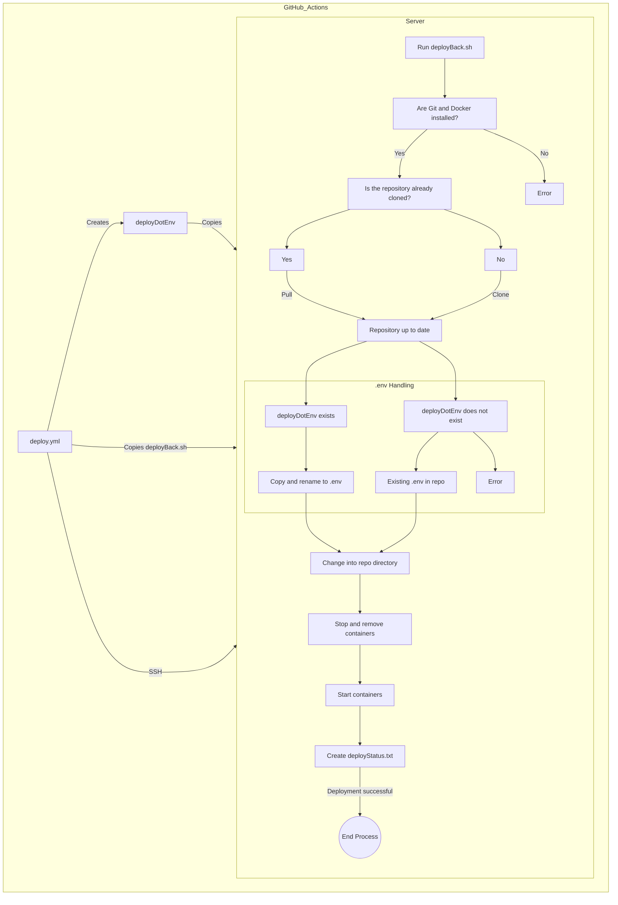

# Automated Deployment Documentation for Constellation Backend via GitHub Actions

WARNING: This is the old deployment documentation for the Constellation backend. It has to be updated to reflect the current deployment process.

## Prerequisites

- A remote server (VPS, dedicated server, etc.) running a Linux distribution (Ubuntu 20.04 LTS or newer recommended)
- Docker and Docker Compose installed on the server
- Git configured with the necessary permissions to clone and pull the repo
- A user with passwordless sudo privileges (to run Docker commands)

## GitHub Action for Deployment

The Constellation backend deployment is automated via GitHub Actions.
The GitHub Action is defined in the `.github/workflows/deploy.yml` file of the repository.

### Steps in the GitHub Action

1. Clone the repository on the remote server (checkout)
2. Set up the SSH key to connect to the remote server (SSH key retrieved from GitHub Secrets)
3. Create the `.env` file from GitHub Secrets, then copy it to the remote server
4. Copy the deployment script `deployBack.sh` to the remote server
5. Execute the deployment script

### GitHub Secrets

For the GitHub Action to work, add the following secrets to the repository:

- `secrets.DEPLOY_IP`: IP address of the remote server
- `secrets.DEPLOY_USER`: Username to log in to the remote server
- `secrets.EPITECH_REPO_SSH_KEY`: Private SSH key to connect to the remote server
- `secrets.DEPLOY_ENV_PIPENV_VENV_IN_PROJECT`: `PIPENV_VENV_IN_PROJECT` environment variable, to be placed in the `.env` file on the remote server
- `secrets.DEPLOY_ENV_TARGET`: `TARGET` environment variable, to be placed in the `.env` file
- `secrets.DEPLOY_ENV_POSTGRES_USER`: `POSTGRES_USER` environment variable, to be placed in the `.env` file
- `secrets.DEPLOY_ENV_POSTGRES_PASSWORD`: `POSTGRES_PASSWORD` environment variable, to be placed in the `.env` file
- `secrets.DEPLOY_ENV_POSTGRES_HOST`: `POSTGRES_HOST` environment variable, to be placed in the `.env` file
- `secrets.DEPLOY_ENV_POSTGRES_PORT`: `POSTGRES_PORT` environment variable, to be placed in the `.env` file
- `secrets.DEPLOY_ENV_POSTGRES_DB`: `POSTGRES_DB` environment variable, to be placed in the `.env` file
- `secrets.DEPLOY_ENV_JWT_SECRET_KEY`: `JWT_SECRET_KEY` environment variable, to be placed in the `.env` file

## Deployment Script

The deployment script `deployBack.sh` is executed on the remote server by the GitHub Action.

### Steps in the Deployment Script

1. Verify that Git and Docker are installed on the server
2. Check if the repository has already been cloned on the server
   - If yes, pull the repository
   - If no, clone the repository
3. Copy the `.env` file created by the GitHub Action (`deployDotEnv`) into the repository
   - If the file `~/deployDotEnv` exists on the server, copy it and rename it to `.env` in the repository
   - Otherwise, if `~/deployDotEnv` is not present:
     - **And** the repository already contains a `.env` file, continue
     - **And** the repository does not contain a `.env` file, abort the deployment
4. Change into the cloned repository directory
5. Stop and remove existing Docker containers (`docker compose down`)
6. Start the Docker containers (`docker compose up -d`)
7. Create a `deployStatus.txt` file to indicate that deployment was completed and on which date

## Deployment Diagram

