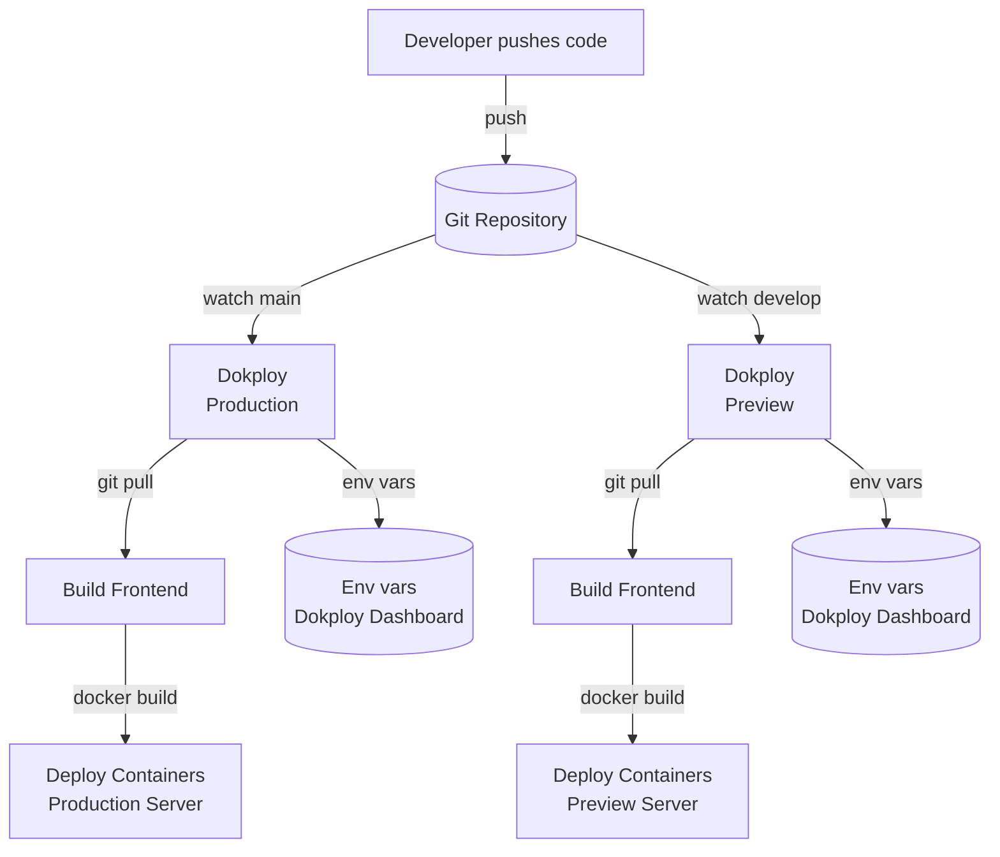

# Frontend Deployment

The frontend of the project is automatically deployed using Dokploy.

Dokploy is watching the `main` branch (for production environment) and the `develop` branch (for preview environment) of the repository for any changes.

When changes are detected, Dokploy builds and deploys the frontend application to the server.

Dokploy manages the deployment process, including pulling the repository, building the application, and starting the docker containers.

The environment variables required for the frontend deployment should be configured in the Dokploy dashboard.

